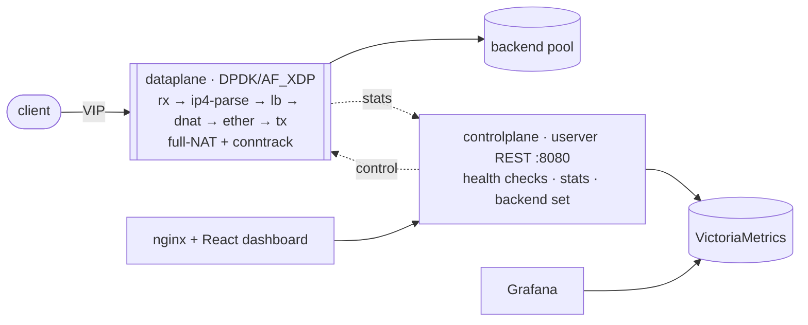

# Cerebellum

A userspace **stateful L4 load balancer** — full-NAT, a VPP-style packet graph,
a live web dashboard, and a Grafana/VictoriaMetrics stack. Cloud-native: no
kernel modules, no VFIO, no hugepages.

The dataplane forwards TCP/UDP flows on **DPDK** via the **AF_XDP** PMD — it
attaches to an existing kernel netdev instead of unbinding the NIC. The
controlplane (on **userver**) health-checks backends, aggregates dataplane stats,
and publishes the live backend set over REST. The two planes **share memory
only** — no RPC.



## Highlights

- **Full-NAT (SNAT + DNAT)** with a bidirectional conntrack table — backends need
  no special return routing. Flows are SYN-gated and reaped on FIN/RST or timeout.
- **Two multi-core modes, auto-selected** — single-thread, or a shared-nothing
  software distributor whose symmetric port steering keeps each flow on one
  worker with no locks.
- **Cloud-native** — Docker Compose (dev + prod), ghcr images, nginx with
  BYO-cert TLS, Grafana + VictoriaMetrics, GitHub Actions CI/CD.

See the [docs](https://mrendor.github.io/cerebellum/) for the architecture and the
full run/deploy guide.

## Quick start

```bash
just test                          # build + run unit tests (no DPDK hardware needed)
CEREBELLUM_IFACE=eth0 docker compose up --build   # full stack on console.localhost
```

## Layout

| Path                 | What                                                                                              |
|----------------------|---------------------------------------------------------------------------------------------------|
| `dataplane/`         | DPDK/AF_XDP I/O, DPDK-free graph engine, pipeline `nodes/`, full-NAT conntrack + steering (`lb/`) |
| `controlplane/`      | userver REST, TCP health checker, stats aggregator, VictoriaMetrics exporter                      |
| `libs/`              | shared-memory IPC (`ipc/`) and config + net types (`common/`)                                     |
| `ui/`                | Vite + React + Tailwind dashboard                                                                 |
| `nginx/`, `grafana/` | reverse proxy (subdomains, TLS) and observability provisioning                                    |
