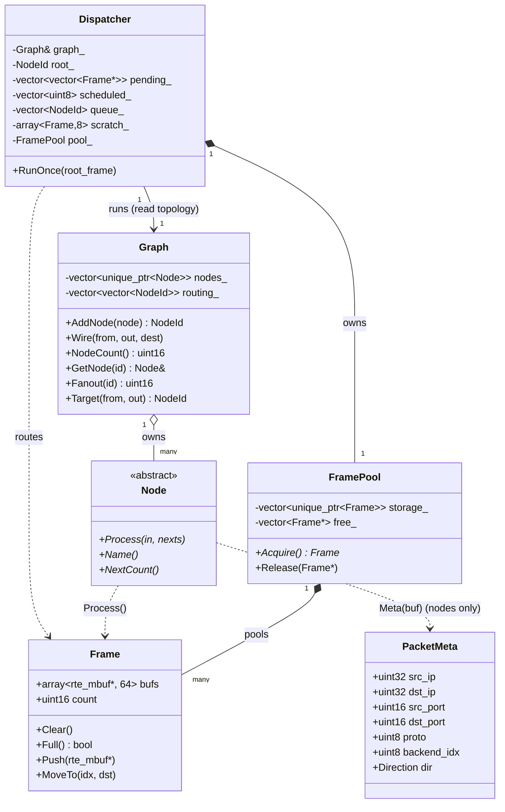
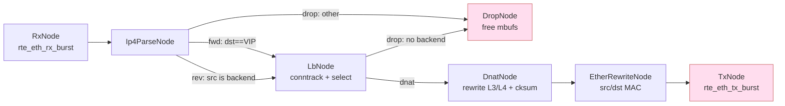
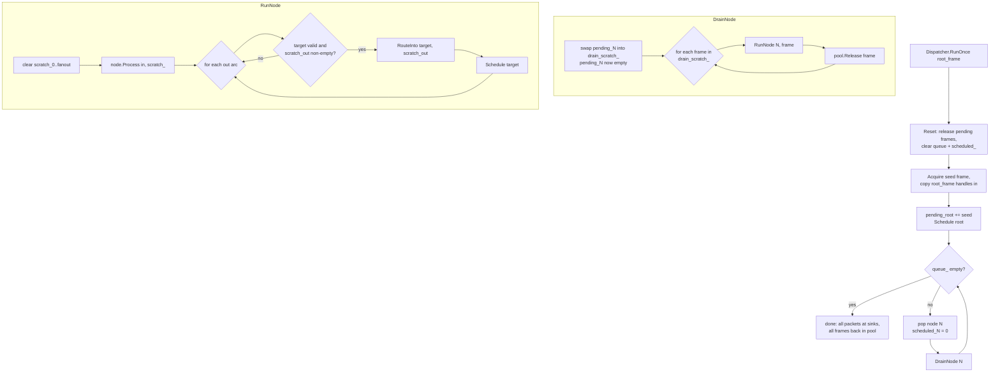
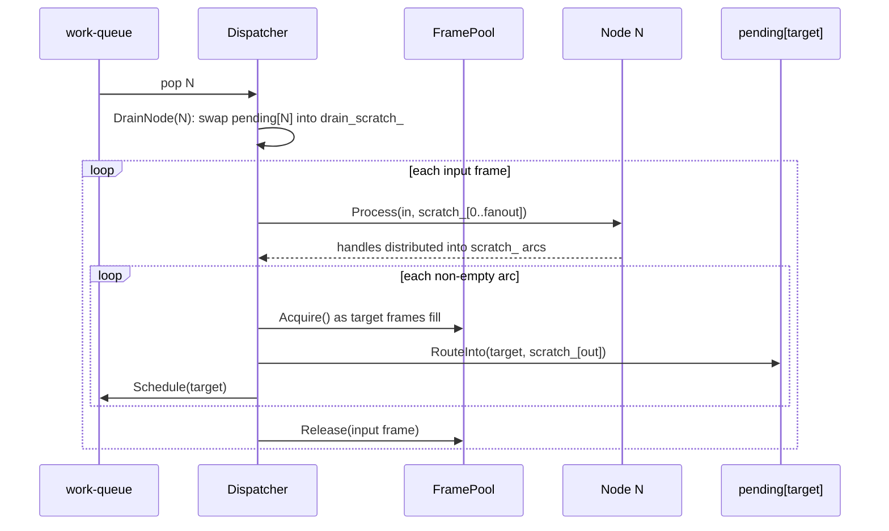
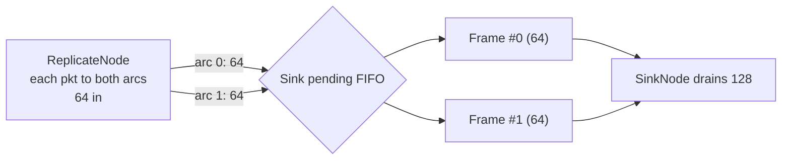

# Graph Engine Architecture

The dataplane forwards packets through a **VPP-style node graph**: each lcore
builds a `Graph` (topology) and runs it with a `Dispatcher` (work-queue
scheduler), packets moving in batches (`Frame`) until the burst is fully
processed. The engine only shuffles buffer handles (`rte_mbuf*`); per-packet
metadata rides inside the mbuf, and the engine never dereferences a buffer.

Responsibilities are split so the build phase and the hot path stay separate:

| File | Type | Role |
|------|------|------|
| `graph/frame.hpp`       | `Frame`      | batch of buffer handles |
| `graph/node.hpp`        | `Node`       | abstract processing stage |
| `graph/graph.hpp`       | `Graph`      | **topology**: nodes + wiring (build-time) |
| `graph/dispatcher.hpp`  | `Dispatcher` | **runtime**: scheduler + per-burst state |
| `graph/frame_pool.hpp`  | `FramePool`  | reusable Frame free-list |
| `graph/packet_meta.hpp` | `PacketMeta` | metadata accessor (production only) |
| `nodes/*.hpp`           | nodes        | concrete stages |

The engine (`frame`/`node`/`graph`/`dispatcher`/`frame_pool`) is DPDK-free: it
only moves opaque `rte_mbuf*` handles (forward-declared), so it builds and unit-
tests without DPDK. The single DPDK seam is `packet_meta` (mbuf dynfield offset
+ `Meta()`/`InitMeta()`), compiled into the `cerebellum_dataplane` binary — not
into the `graph_engine` library.

---

## 1. Types and ownership

Two boundaries:
- **Build vs run**: `Graph` is the immutable topology (`AddNode`/`Wire`);
  `Dispatcher` holds all per-burst state and the pool. You can't rewire while
  running, and each is testable on its own.
- **Engine vs DPDK**: `Frame`/`Node`/`Graph`/`Dispatcher` know nothing about
  `PacketMeta` or DPDK; `rte_mbuf` is a forward-declared opaque handle. Only
  nodes (and `main`, which calls `InitMeta()`) include `packet_meta.hpp`.

---

## 2. The production LB pipeline

Wired once per lcore in `main.cpp::BuildGraph`. Arcs are named outputs
(`kNextFwd`, `kNextDrop`, …).

It is a forward DAG today, but the engine itself imposes no ordering — any node
may route to any node (including itself).

---

## 3. Scheduler: `Dispatcher::RunOnce`

The `Dispatcher` is constructed with the `Graph` and the root node id. A node is
**scheduled** the moment packets are routed to it; the work-queue drains
scheduled nodes until empty.

Why `pending_N` is swapped out before draining: a node routing back to itself
(self-edge) appends to `pending_N` during `Process`; swapping first means those
new frames land in a fresh list for a **later** pop, so the vector being iterated
is never mutated/reallocated underfoot, and per-dispatch work stays bounded.

---

## 4. Frame lifecycle (one hop)

No allocation or zeroing on the hot path: `scratch_` is reused (only `count`
reset), and pending frames come from `FramePool` (a free-list); the only growth
is the first time the pool runs dry.

---

## 5. Fan-in and replication

Metadata-in-mbuf makes replication a pointer operation: push the same handle to
multiple arcs (production also bumps `rte_pktmbuf_refcnt_update`). Accumulation
beyond `kBurstSize` at a target is absorbed by chaining pool frames in its
pending FIFO.

`RouteInto` opens a new pooled frame whenever the current one is `Full()`, so a
node can receive far more than 64 packets in a single dispatch without overflow.

---

## Invariants

- **No locks**: each lcore owns its `Graph`; RSS pins a 5-tuple flow to one lcore.
- **Engine is DPDK-free**: `frame/node/graph/dispatcher/frame_pool` only move
  opaque `rte_mbuf*`; the sole DPDK coupling is `packet_meta` (dynfield +
  `Meta()`), compiled into the dataplane binary, not the `graph_engine` library.
- **Termination is the caller's contract**: cycles are allowed; the graph must
  eventually route every packet to a sink (`NextCount() == 0`).
- **Unwired arcs drop silently**: production wires every arc (to a real node or
  `DropNode`); an unwired arc discards handles (a leak in production, fine in tests).
