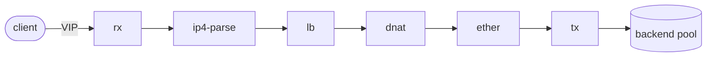

# Cerebellum

A userspace **stateful L4 load balancer** with full-NAT, a VPP-style packet
graph, a live web dashboard, and a Grafana/VictoriaMetrics observability stack —
cloud-native, with no kernel modules and no hugepages.

## What it does

The **dataplane** forwards TCP/UDP flows on **DPDK** through the **AF_XDP** PMD.
Instead of unbinding the NIC, it attaches to an existing kernel netdev — so there
is no VFIO and no hugepage setup. Packets run through a **VPP-style node graph**
in 64-packet batches:

The **controlplane** (built on [userver](https://userver.tech)) health-checks the
backends over TCP, aggregates the dataplane's counters, and publishes the live
backend set. A React dashboard polls its REST API once a second; VictoriaMetrics
scrapes the same numbers for Grafana.

The two planes **share memory only** — no RPC. The dataplane creates the shared
segments; the controlplane attaches them. A version-stamped `ShmHeader` guards
the ABI, so a mismatched build degrades gracefully instead of reading a stale
layout.

## Highlights

- **Full-NAT (SNAT + DNAT).** Both directions are rewritten, so backends see
  traffic from the load balancer and need no special return routing. A
  bidirectional connection-tracking table links the forward and reverse 5-tuples.
- **Accurate connection tracking.** Flows are SYN-gated (only a TCP SYN opens a
  flow), released on FIN/RST, and reaped lazily on timeout — the live
  `active_flows` count stays honest.
- **Two multi-core modes, picked automatically.** A single-thread mode for the
  simplest path, and a shared-nothing **software distributor** where an IO lcore
  steers each flow to a worker by hash and symmetric port allocation guarantees
  the reverse packet lands back on the same worker — no locks, no cross-core
  conntrack misses.
- **Cloud-native deployment.** Docker Compose for dev and prod, images on ghcr,
  nginx with bring-your-own-cert TLS, and a Grafana + VictoriaMetrics stack —
  wired together by GitHub Actions CI/CD.

See **[Getting started](getting-started.md)** to build it and bring the stack up.
